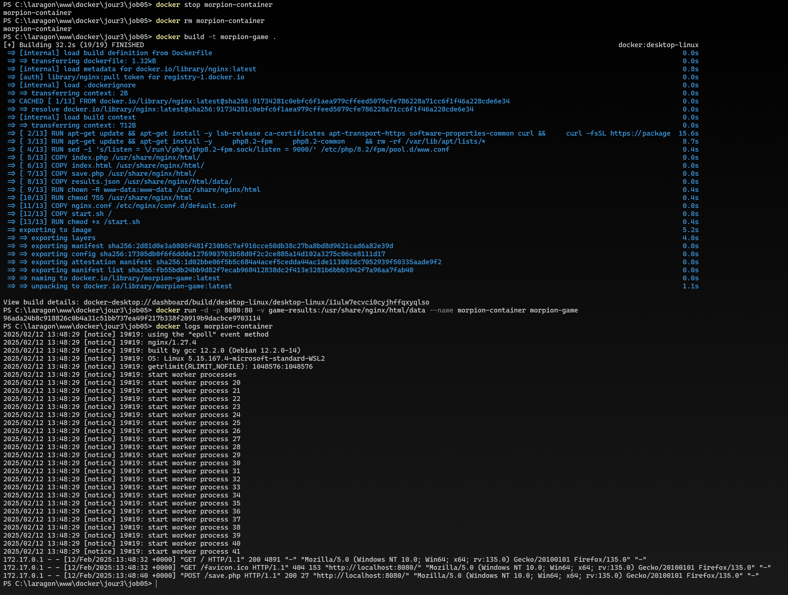

# Job 05 - Morpion avec Docker et Nginx

## Captures d'écran du projet

### 1. Interface du jeu et résultats

Cette capture montre l'interface du jeu de morpion :
- Le plateau de jeu 3x3
- L'indicateur du joueur actuel
- Le bouton de réinitialisation
- L'état de la partie en cours

### 2. Sauvegarde et logs Docker

Cette capture montre :
- Les résultats sauvegardés dans results.json
- Les victoires des joueurs X et O
- Les matchs nuls enregistrés
- La date et l'heure de chaque partie
- Les logs du conteneur Docker montrant le bon fonctionnement

## Configuration
- Image de base : Nginx
- Port exposé : 80
- Volume pour les résultats : data/results.json
- PHP-FPM configuré pour gérer les scripts PHP

## Fonctionnalités
- Jeu de morpion interactif
- Sauvegarde automatique des résultats
- Interface responsive
- Gestion des tours de jeu
- Détection des victoires et matchs nuls

### Terminal avec commandes Docker

