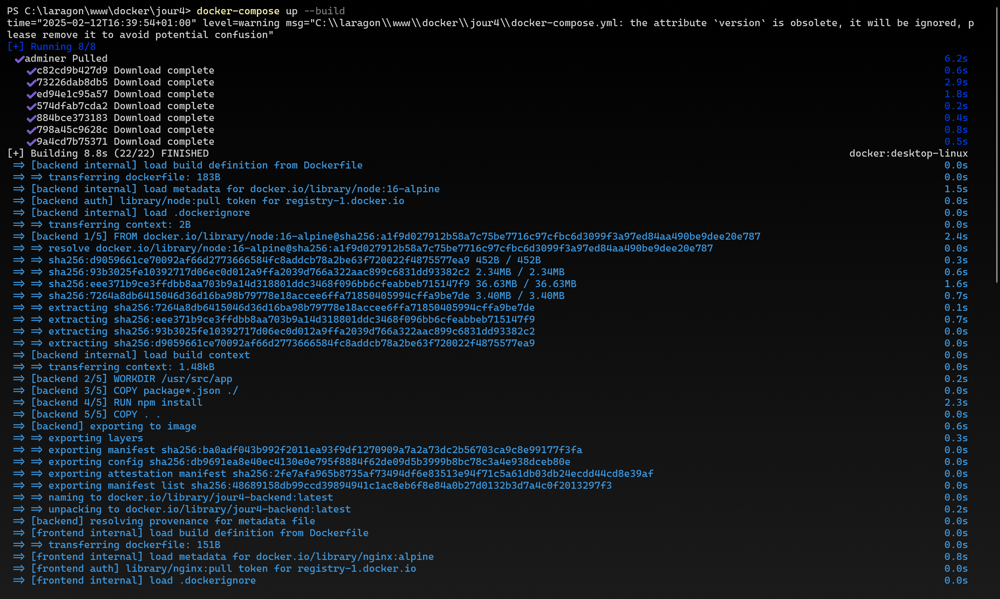

# Projet Multi-Conteneurs avec Docker

Ce projet est une application web complète utilisant une architecture multi-conteneurs avec Docker. Il comprend un frontend en Nginx, un backend Node.js, une base de données MySQL et un gestionnaire de base de données Adminer.

## Prérequis

- Docker
- Docker Compose
- Git (pour cloner le projet)

## Structure du Projet

```
jour4/
├── backend/
│   ├── Dockerfile
│   ├── package.json
│   └── server.js
├── frontend/
│   ├── Dockerfile
│   └── html/
│       └── index.html
├── mysql/
│   └── init.sql
├── nginx/
│   └── nginx.conf
└── docker-compose.yml
```

## Installation et Déploiement

1. Construisez et démarrez les conteneurs :
```bash
docker-compose up --build
```

## Accès aux Services

Une fois les conteneurs démarrés, vous pouvez accéder aux différents services :

- **Frontend** : http://localhost:8080
- **Backend API** : http://localhost:3000
  - Point d'accès de test : http://localhost:3000/api/test
  - Point d'accès base de données : http://localhost:3000/api/db-test
- **Adminer** (gestionnaire de base de données) : http://localhost:8081
  - Système : MySQL
  - Serveur : db
  - Utilisateur : user
  - Mot de passe : password
  - Base de données : projetdb
- **MySQL** : localhost:3306 (accessible depuis votre machine hôte)

## Configuration des Services

### Frontend (Nginx)
- Port : 8080
- Sert les fichiers statiques
- Proxy inverse vers le backend pour les routes /api

### Backend (Node.js)
- Port : 3000
- API RESTful
- Connexion à la base de données MySQL
- Routes disponibles :
  - /api/test : Test du backend
  - /api/db-test : Test de la base de données
  - /api/status : État du serveur

### Base de données (MySQL)
- Port : 3306
- Base de données : projetdb
- Utilisateur : user
- Mot de passe : password
- Volume persistant pour les données
- Table de test : test_table

### Adminer
- Port : 8081
- Interface web pour gérer la base de données

## Commandes Utiles

### Gestion des Conteneurs
```bash
# Démarrer les services
docker-compose up

# Démarrer les services en arrière-plan
docker-compose up -d

# Arrêter les services
docker-compose down

# Voir les logs
docker-compose logs

# Voir les logs d'un service spécifique
docker-compose logs [service]
```

### Accès au Shell des Conteneurs
```bash
# Accéder au shell MySQL
docker exec -it jour4-db-1 mysql -uuser -ppassword projetdb

# Accéder au shell du backend
docker exec -it jour4-backend-1 sh

# Accéder au shell du frontend
docker exec -it jour4-frontend-1 sh
```

## Dépannage

1. Si les conteneurs ne démarrent pas :
   - Vérifiez que les ports ne sont pas déjà utilisés
   - Vérifiez les logs avec `docker-compose logs`

2. Si la base de données n'est pas accessible :
   - Vérifiez que le conteneur MySQL est en cours d'exécution
   - Vérifiez les identifiants de connexion
   - Attendez quelques secondes que MySQL initialise complètement

3. Si le backend ne se connecte pas à la base de données :
   - Vérifiez les variables d'environnement dans docker-compose.yml
   - Vérifiez les logs du backend

## Développement

Pour développer localement :

1. Les modifications du code source sont automatiquement prises en compte grâce aux volumes montés
2. Les fichiers statiques du frontend peuvent être modifiés directement dans le dossier frontend/html
3. Les modifications du backend nécessitent un redémarrage du conteneur

## Sécurité

Note : Cette configuration est destinée au développement. Pour la production :

1. Changez les mots de passe par défaut
2. Désactivez l'accès public à Adminer
3. Configurez HTTPS
4. Limitez les ports exposés
5. Utilisez des secrets Docker pour les informations sensibles

## Captures d'écran

### 1. Démarrage des Services

Cette capture d'écran montre le démarrage réussi de tous les services :
- Les conteneurs sont créés dans l'ordre : adminer, backend, db, et frontend
- MySQL démarre et initialise sa base de données
- Le serveur PHP d'Adminer démarre sur le port 8080
- Les logs montrent les différentes étapes d'initialisation de MySQL

### 2. Build des Conteneurs

Cette capture montre le processus de build des conteneurs :
- Téléchargement des images de base
- Construction du backend avec Node.js
- Installation des dépendances npm
- Construction du frontend avec Nginx
- Les temps d'exécution de chaque étape sont affichés

Ces captures démontrent que :
1. L'architecture multi-conteneurs fonctionne correctement
2. Tous les services démarrent sans erreur
3. Les connexions entre les services sont établies
4. Le système de logging fonctionne et permet de suivre l'état des services
